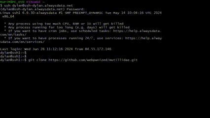
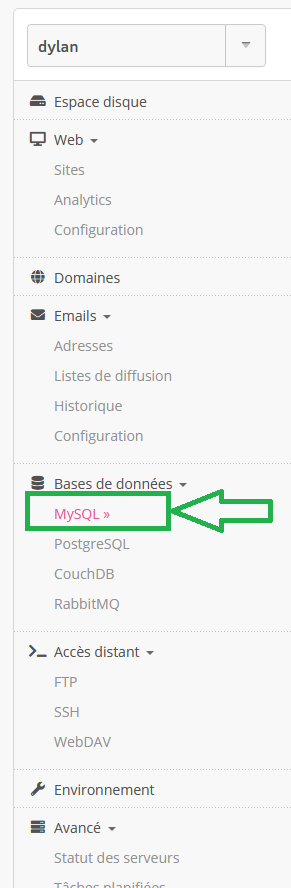
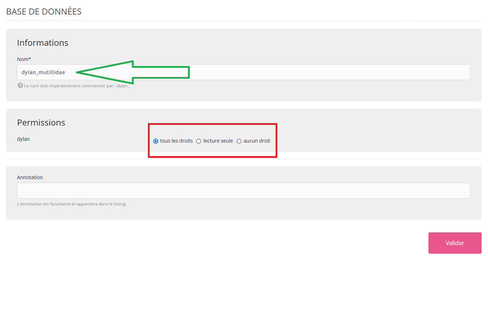
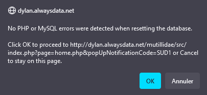
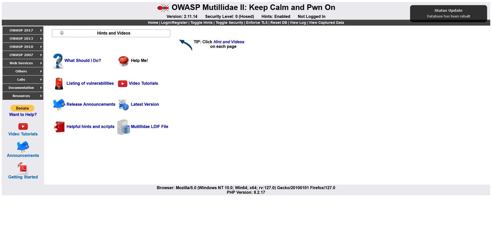

ESIEE-IT - (BTS SIO SLAM) - 13/06/2024

---

Mutillidae est un site web développé par OWASP pour identifier et tester les failles de sécurité. Ce projet open-source est conçu pour fournir une plateforme d'apprentissage pratique où les testeurs peuvent se familiariser avec les vulnérabilités courantes des applications web. En simulant un environnement réel contenant diverses failles de sécurité, Mutillidae permet aux utilisateurs de pratiquer l'exploitation de ces vulnérabilités et d'apprendre à les corriger.

---

### 📜 **Comment installer Mutillidae sur AlwaysData ?**

Voici les étapes à suivre pour installer Mutillidae :

1. Se connecter au serveur ssh de notre espace AlwaysData avec cette commande :

>`ssh <nom_du_compte_alwaysdata>@ssh-<nom_de_l'utilisateur_ssh>.alwaysdata.net`

Voici l'exemple dans mon cas :

 >`ssh dylan@ssh-dylan.alwaysdata.net`

2. On se positionne dans le répertoire **www** à l'aide de `cd www` et on écrit la commande suivante qui servira à importer mutillidae :

>`git clone https://github.com/webpwnized/mutillidae.git`

3. On se positionne dans le répertoire **src** à l'aide de `cd mutillidae/src` et on renomme le fichier .htaccess. Cela va nous donner l'accès à l'environnement propice à l'apprentissage des vulnérabilités et des techniques d'exploitation. Voici la commande à écrire :

>`mv .htaccess no.htaccess`

### 📜 **Configuration de la base de données MySQL pour Mutillidae**

Après avoir renommé le fichier .htaccess, vous devez configurer la base de données MySQL pour que Mutillidae fonctionne correctement. Voici les étapes à suivre :

1. Créer une base de données MySQL dédiée :

- Connectez-vous à l'interface de gestion MySQL d'AlwaysData.

    

- Créez une nouvelle base de données. Par exemple, nommez-la "user"_mutillidae.

    

2. Ajouter un utilisateur MySQL dédié :

- Toujours dans l'interface de gestion MySQL, ajoutez un nouvel utilisateur avec tous les droits sur la base de données user_mutillidae. Par exemple, utilisez user_mutilliuser comme nom d'utilisateur et mutillipwd comme mot de passe.

    

3. Modifier le fichier de configuration de la base de données :

- Localisez le fichier database-config.inc dans le répertoire mutillidae/src/includes.

- Ouvrez le fichier et mettez à jour les informations de connexion à la base de données avec les détails de votre base de données et de l'utilisateur créés précédemment.

    
     il manque un i dans le password...

4. Initialiser la base de données :

- Cliquez sur le lien proposé pour reconstruire la base de données.

    

- Acceptez la pop-up

    
    
- Vous voilà arrivé à la fin de l'installation.

    

### Attention, n'oubliez pas de renommer votre fichier `no.htaccess` en enlevant le `no`

Pour cela, on se positionne dans le répertoire **src** à l'aide de `cd mutillidae/src` et on exécute la commande suivante :

    mv no.htaccess .htaccess