ESIEE-IT - (BTS SIO SLAM) - 13/06/2024

---

## Travail à faire 1

### 📜 **Créer un compte permettant de vous authentifier sur la plateforme.**

Supposons que votre mutillidae est correctement installé. Accédez à votre site à l'aide de cet url : 
`user.alwaysdata.net/mutillidae/src`

Pour ma part, le lien est le suivant :
`dylan.alwaysdata.net/mutillidae/src`

Accédez à la page d'inscription en appuyant sur **`Login/Register`**

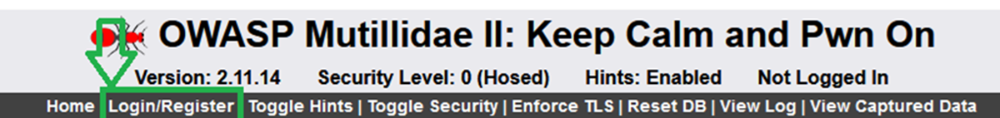

Dans l'encadré **`Please sign-in`**, en dessous se trouve **Please register here**. Cliquez dessus.

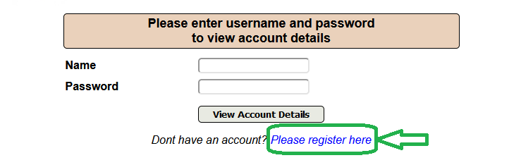

Renseignez votre **nom d'utilisateur**, votre **mot de passe**. La signature est optionnelle.

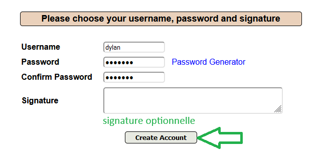

Une fois le bouton **`Create Account`** pressé, votre compte est créé.

### 📜 **Utiliser une méthode de voter choix afin de découvrir les noms des champs login et mot de passe du formulaire d'authentification.**

J'ai décidé d'utiliser le menu **`F12`** du navigateur et d'inspecter l'élément `input`

Voici donc les noms des champs **`login`** et **`mot de passe`** du formulaire d'authentification.
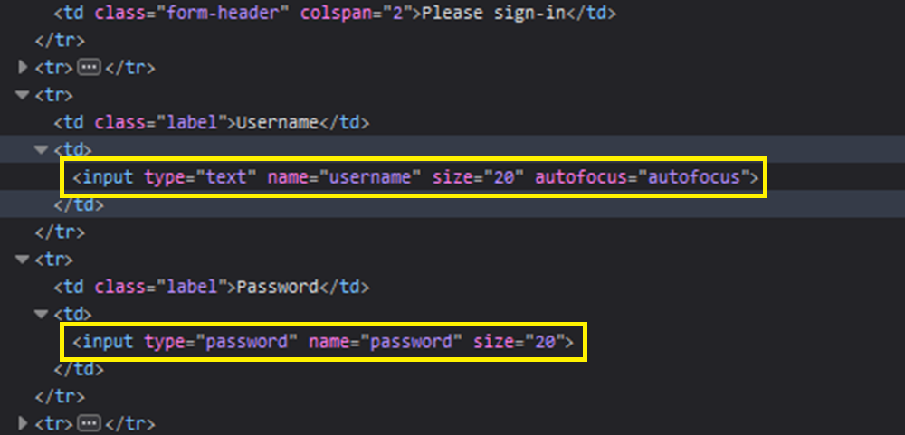

### 📜 **Positionner le niveau de sécurité du code à 0 (Hosed).**

Le niveau de sécurité est initialement positionné à 0. Si l'on souhaite modifier cette sécurité, il suffit d'appuyer sur le bouton **`Toggle Security`**. 
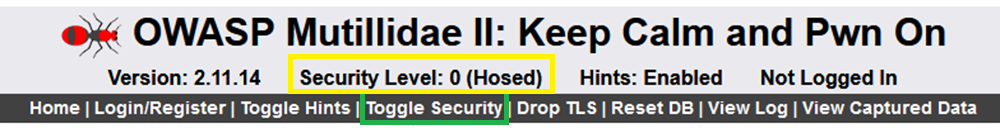

Il existe 3 niveaux de sécurité :
- Security Level: 0 (Hosed) 
- Security Level: 1 (Client-Side Security)
- Security Level: 5 (Secure)

---

## Travail à faire 2

### 📜 **Tester une détection manuelle de la sensibilité SQLi.**

Pour tester la sensibilité SQLi, je provoque une erreur lors de la connexion via un nom d'utilisateur et un mot de passe. En écrivant `'` dans le champ **username** et dans le champ **password**, une erreur **exception occurred** est provoquée et un message d'erreur trop explicite apparaît.

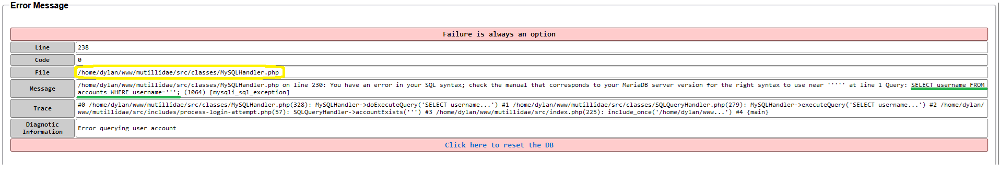

J'ai souligné en vert et encadré en jaune les éléments trop explicites qui laissent des failles de sécurité.

---

## Travail à faire 3

### 📜 **Réaliser les deux défis présentés en testant les injections suivantes et reporter sur votre documentation les injections testées :**
- 'or ('a' = 'a') or'
- 'or username='admin

***Pour le premier défi, le but est d'obtenir la liste de tous les utilisateurs.***

Allons sur la page suivante : 
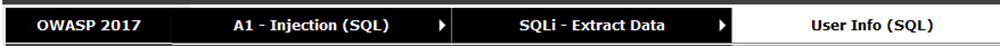

Ensuite, injectons la première requête dans n'importe quelle champs, soit **`username`** soit **`password`** et appuyons sur **`View Account Details`** :
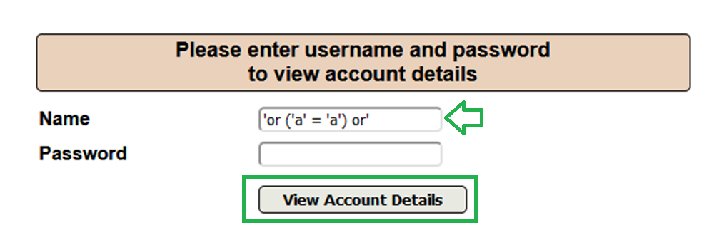

La liste de **TOUS** les utilisateurs apparaît, mission accomplie.
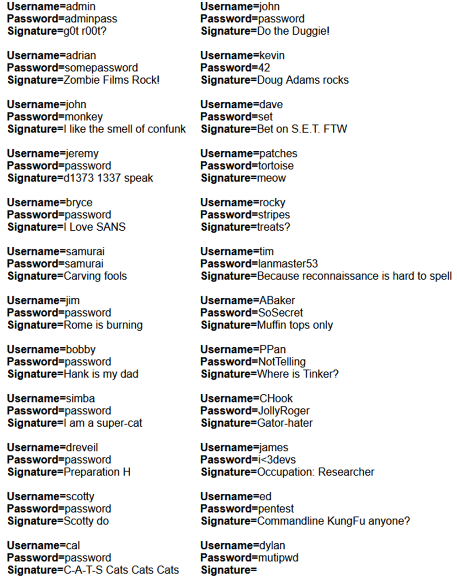

***Pour le second défi, le but est de s'authentifier à l'aide du compte d'un autre utilisateur de notre choix.***

Allons sur la page suivante : 
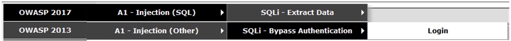

Ensuite, injectons la seconde requête dans le champ **`password`** et appuyons sur **`Login`** :
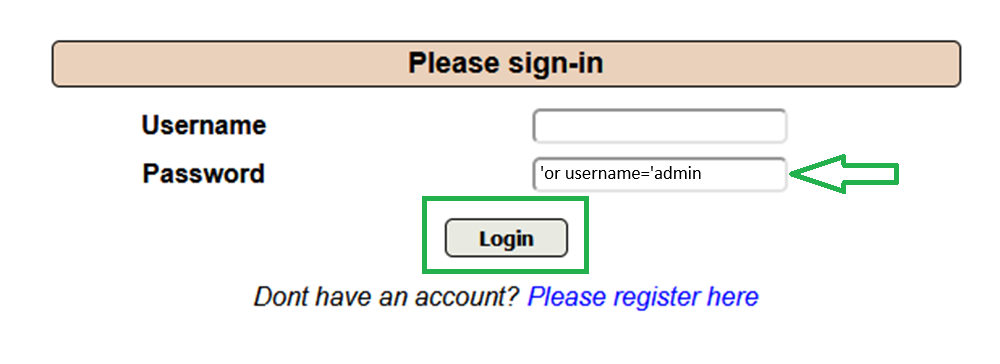

Nous voilà connecté en tant qu'**`admin`** sur le site.
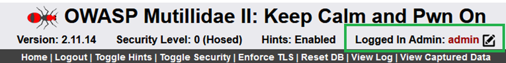

---

## Travail à faire 4

### 📜 **Modifier le niveau de sécurité et vérifier que les tests d'exploitation des failles SQLi échouent.**

**Pour rappel**, le niveau de sécurité est initialement positionné à 0. Si l'on souhaite modifier cette sécurité, il suffit d'appuyer sur le bouton **`Toggle Security`**. 

Modifions le à 1 (Client-Side Security).

Testons d'abord de provoquer la sensibilité SQLi en essayant de se connecter à l'aide de `d` en tant qu'**``username`** et `'` en tant que **`password`** :

Le message dévoilant des informations trop explicites apparaît. Failles de sécurité présentes.
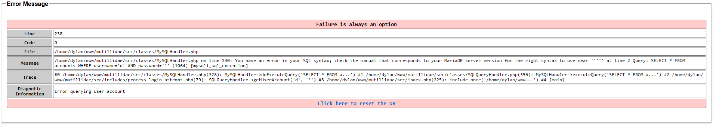

Testons les requêtes précédentes et constatons le résultat.
En effet, nous ne pouvons désormais plus entrer simplement un **`username`** ou un **`password`**, les deux doivent être renseignés. De plus, un message d'erreur apparaît lorsque nous écrivons la même requête dans les deux champs :
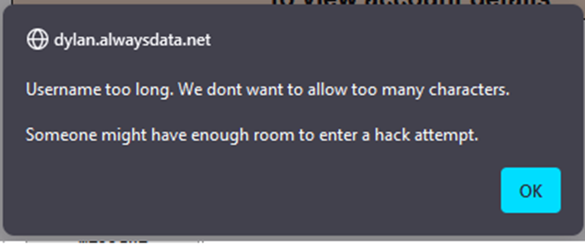

Il y a déjà un peu plus de sécurité, mais cela ne suffit pas ! Passons au niveau maximal de sécurité, c'est à dire le niveau 5 (Secure).

Prenons le même schéma et essayons de nous connecter  à l'aide de `d` en tant qu'**``username`** et `'` en tant que **`password`**. En effet, un message `Username or password incorrect` apparaît mais pas le message qui dévoile les logs trop explicites. C'est un bon début.
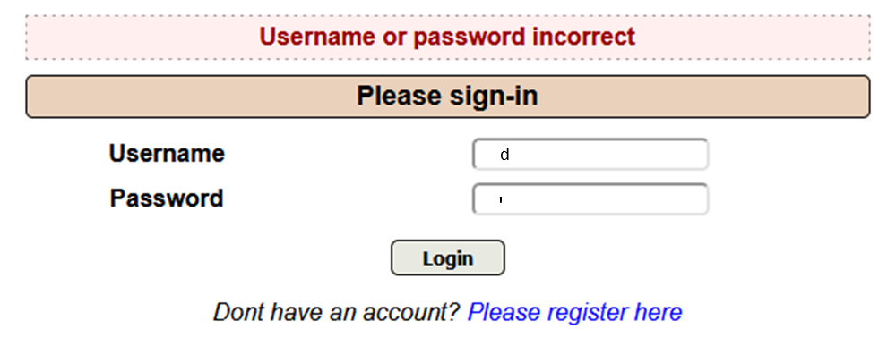

Maintenant, testons les deux requêtes précédentes. Même message d'erreur. 

### 📜 **Quel niveau de sécurité est nécessaire pour protéger contre cette attaque ?**

Le niveau de sécurité nécessaire est le 5 (Secure) car il empêche les requêtes SQL pour récupérer la liste des users. Des techniques de protection plus robustes sont implémentées pour contrer les injections SQL.

### 📜 **A ce niveau, quels sont les contrôles réalisés ?**

Le niveau 5 inclue des contrôles robustes tels que des validations serveur pour s'assurer que les entrées utilisateurs respectent les formats attendus avant de les traiter. Il utilise des requêtes paramétrées pour séparer les données utilisateurs du SQL.

### 📜 **Est-ce que le contrôle HTML aurait suffi à protéger contre cette injection SQL ?**

Je dirai que non, les contrôles HTML sont exécutés côté client et peuvent être facilement contournés. Les vérifications côté serveur sont essentielles pour valider les données après réception.

### 📜 **Comment la validation JavaScript est-elle déclenchée ?**

La validation JavaScript est déclenchée lors de l'envoi du formulaire ('onsubmit') ou lorsque l'utilisateur interagit avec les champs.

### 📜 **Quels sont les contrôles réalisés par la validation JavaScript ?**

La validation JS inclue la vérification que tous les champs requis soient remplis, que les données saisies respectent les formats attendus et les contraintes de longueur et que seuls les caractères autorisés soient utilisés.
