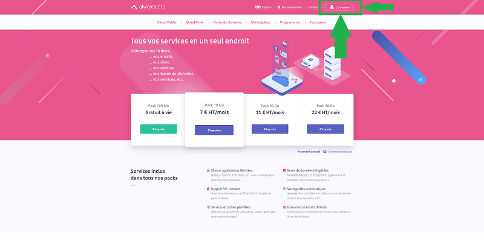
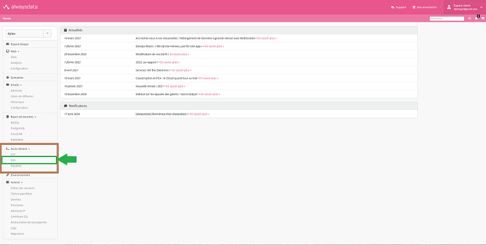
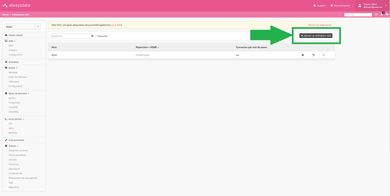
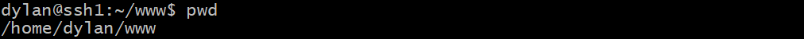
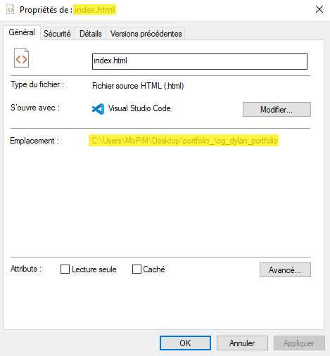
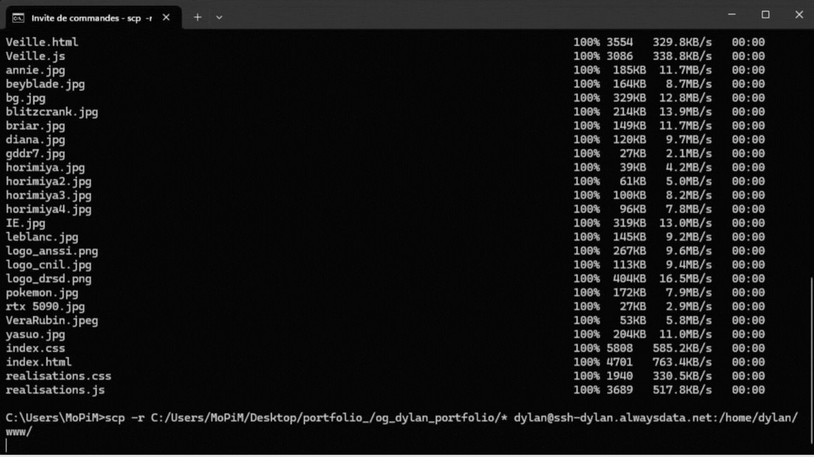
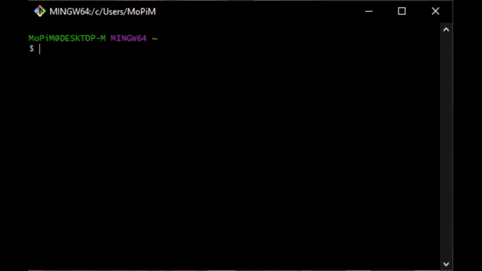

ESIEE-IT - (BTS SIO SLAM) - 18/04/2024

---

### 📜 **Quels services sont offerts par Alwaysdata ?**

Alwaysdata est un fournisseur de services d'hébergement web. Il propose :

- **Hébergement de sites web et d'applications web.**
- **Gestion de domaines.**
- **Support technique pour aider ses clients.**
- **Gestion de bases de données.**
- **Sécurisation des sites web avec des certificats SSL.**
- **Outils de développement et de déploiement.**
- **Services de sauvegarde et de restauration.**

### 📜 **Quels services seront nécessaires pour déployer un site web (HTML, CSS, JS et PHP) ?**

Pour déployer un site web, vous aurez besoin de :

- **Hébergement de sites web et d'applications web** : Pour stocker les fichiers du site et les rendre accessibles en ligne.
- **Gestion de domaines** : Pour associer un nom de domaine personnalisé à votre site web.
- **Gestion de bases de données** : Si le site nécessite de manipuler des données dynamiquement.
- **Sécurisation des sites web avec des certificats SSL** : Pour garantir la sécurité des données échangées entre le site et les utilisateurs.
- **Outils de développement et de déploiement** : Pour faciliter le processus de développement et de mise en ligne du site.
- **Services de sauvegarde et de restauration** : Pour protéger les données du site et assurer une récupération en cas de besoin.

### 📜 **Quel est le nom de domaine choisi pour le déploiement de votre site ?**

Le nom de domaine choisi est le suivant : `dylan.alwaysdata.net`

---

### 📜 **Expliquer l'intérêt du protocole SSH. Sur quel port est-il actif par défaut ?**

Le protocole SSH permet aux utilisateurs d’établir une connexion sécurisée entre deux ordinateurs afin de transférer des fichiers de manière sécurisée. Par défaut, le protocole SSH est actif sur le port 22. Cependant, il est souvent recommandé de modifier ce port par défaut pour des raisons de sécurité.

### 📜 **Quel autre protocole semble avoir les mêmes fonctionnalités ? Que fait SSH qui n'est pas possible avec le 2e ?**

Le protocole FTP transfère des fichiers, mais il manque de sécurité. Contrairement au SSH, qui chiffre les données, le FTP envoie les données en texte clair, sans sécurisation. Avec le SSH, nous pouvons donner des instructions directes au serveur via des commandes, tandis que le FTP est seulement pour le transfert de fichiers entre l'ordinateur et le serveur.

### 📜 **Activer un accès au serveur via ce protocole. Quelles étapes sont nécessaires ?**

1. Se connecter à son compte sur le site d'AlwaysData.

     

2. Dans la section "Accès Distant", accéder à SSH.

     

3. Créer un nouvel utilisateur SSH en spécifiant un nom d'utilisateur et un **mot de passe**.

     

Après avoir effectué ces étapes, l'accès au serveur sera activé et vous pourrez y accéder grâce à votre nouvel utilisateur SSH.

### 📜 **Se connecter à votre espace dédié sur le serveur via ce protocole. Quelle est la ligne de commande nécessaire pour y arriver ?**

Après avoir créé l'utilisateur SSH, utiliser un logiciel SSH tel que PuTTY (sur Windows) ou Terminal (sur macOS ou Linux).
1. Se connecter au serveur en utilisant l'adresse spécifiée, généralement sous la forme 

    >`ssh <nom_du_compte_alwaysdata>@ssh-<nom_d'utilisateur_SSH>.alwaysdata.net`

2. Saisir le nom d'utilisateur et le mot de passe que vous avez définis précédemment.

Si les informations sont correctes, vous devriez être connecté au serveur via SSH et prêt à exécuter des commandes. Voici l'exemple d'une commande type à entrer pour se connecter au serveur : 

>`ssh dylan@ssh-dylan.alwaysdata.net`

### 📜 **Dans quel répertoire faut-il déposer vos fichiers du site si vous voulez le voir en ligne ?**

Pour voir vos fichiers déposés sur le site en ligne, vous devez les placer dans le répertoire "www" situé dans le répertoire principal de votre compte Alwaysdata. Le chemin complet est généralement :

>`/home/"nom_du_compte_alwaysdata"/www/`

Voici l'exemple du chemin complet pour mon site :

>`/home/dylan/www/`

 

---

 

### 📜 **Quel est le chemin local absolu pour accéder à votre site ?**

Le chemin pour accéder à mon site localement est le suivant : 

>`C:/Users/MoPiM/Desktop/portfolio_/og_dylan_portfolio/index.html`

 

### 📜 **Quel est le chemin absolu du repertoire dédié sur le serveur Alwaysdata ?**

Le chemin du répertoire dédié à mon site sur le serveur est le suivant :

>`/home/dylan/www/`

### 📜 **Les commandes `scp` et `rsync` peuvent être d'une grande aide à cette étape. Pourquoi ?**

Les deux commandes servent à transférer des données en utilisant le protocole SSH. Nous devrons donc les utiliser si nous voulons ajouter les fichiers de notre site sur le répertoire distant.

### 📜 **Quelle est la différence entre les deux commandes ?**

La différence entre les deux commandes réside dans leur méthode de gestion du transfert de fichiers. `scp` est principalement utilisé pour transférer des fichiers individuels ou des répertoires entiers de manière sécurisée entre deux machines distantes, tandis que `rsync` est plus efficace pour la synchronisation de répertoires complets en ne transférant que les différences entre les fichiers source et de destination, ce qui le rend idéal pour les mises à jour incrémentielles et la sauvegarde.

### 📜 **Quelle est la commande complète pour ajouter les fichiers sauvegardés en local sur le serveur dédié ?**

la commande complète pour ajouter les fichiers sauvegardés en local sur le serveur dédié est la suivante : 

>`scp -r chemin/du/fichier/fichier.xxx <nom_du_compte_alwaysdata>@ssh-<nom_d'utilisateur_SSH>.alwaysdata.net:/home/<nom_du_compte_alwaysdata>/www/`

Le `-r` est utilisé pour copier récursivement tout le contenu du répertoire local, y compris les sous-répertoires.

Dans mon cas, j'ai exécuté cette commande : 

>`scp -r C:/Users/MoPiM/Desktop/portfolio_/og_dylan_portfolio/* dylan@ssh-dylan.alwaysdata.net:/home/dylan/www/`

Voici ce que c'est censé faire :

### 📜 **Comment vérifier que l'ajout a bien été effectué ? Détailler la procédure et les résultats attendus.**

Pour vérifier que l'ajout des fichiers sur ton serveur SSH a bien été effectué, nous pouvons suivre ces étapes :

1. Se connecter au serveur SSH grâce à cette commande :

    >`ssh dylan@ssh-dylan.alwaysdata.net`

    Assure-toi de remplacer les "dylan" par premièrement ton nom d'utilisateur AlwaysData et deuxièmement par ton nom d'utilisateur SSH.

2. Naviguer vers le répertoire de destination. 
    
    En effet, une fois connecté au serveur, on peut utiliser la commande `cd` pour se déplacer vers le répertoire où les fichiers ont été copié. Dans notre cas, on peut utiliser la commande suivante pour accéder au répertoire `/home/dylan/www/` :

    >`cd /home/dylan/www/`

3. Vérification des fichiers : Une fois dans le répertoire de destination, on peut utiliser la commande `ls` pour lister tous les fichiers et répertoires présents. On s'assure que les fichiers que ajoutés sont bien répertoriés.

### 📜 **Quelle URL permet de voir votre site en ligne ?**

>`http://dylan.alwaysdata.net/`

---

 

### 📜 **Expliciter dans vos mots ce principe d'authentification**

Le principe d'authentification par clé privée en SSH fonctionne en demandant à l'utilisateur de posséder une clé privée ainsi qu'une passphrase (<- optionnel). Cette méthode renforce la sécurité comparée à l'authentification par mot de passe seul, car elle élimine la nécessité de transmettre les mots de passe sur le réseau. De plus, elle offre une méthode pratique et sécurisée pour authentifier les utilisateurs.

### 📜 **Notez les avantages à se connecter avec une paire de clé privée et publique vs se connecter avec mot de passe**

Se connecter avec une paire de clés privée et publique renforce la sécurité en évitant la transmission de mots de passe sur le réseau et simplifie l'authentification en supprimant le besoin de mémoriser et de saisir des mots de passe à chaque connexion.

### 📜 **Noter les étapes nécessaires pour y parvenir**

1. Aller sur son environnement local et générer une clé à l'aide de cette commande et d'un terminal linux : 

    >`ssh-keygen -t rsa -b 4096 -C votre@email.com`

    Dans mon cas, la commande était la suivante : 

    >`ssh-keygen -t rsa -b 4096 -C dylanog1@gmail.com`

2. Copier et envoyer la clé sur notre serveur distant à l'aide de : 

    >`ssh-copy-id -i ~/.ssh/id_rsa.pub <username>@<ipaddress>`

    Dans mon cas, la commande était la suivante : 

    >`ssh-copy-id -i ~/.ssh/id_rsa.pub dylan@ssh-dylan.alwaysdata.net`

    L'option `-t` spécifie le type de clé, `-b` définit sa longueur en bits, `-C` ajoute un commentaire pour l'identifier, et `-i` convertit les clés entre différents formats.

Arrivé à ce stade, vous devez être capable de vous connecter à votre serveur distant à l'aide de votre ordinateur local sans que ça ne vous demande un mot de passe et en utilisant la commande ci-dessous.

 

### 📜 **Notez les étapes pour en tester le bon fonctionnement** 

Pour en tester le bon fonctionnement :

1. Ouvrez GIT BASH pour Windows ou Terminal pour Linux/MacOS

2. tapez la commande suivante pour vous connecter au serveur distant :

    >`ssh dylan@ssh-dylan.alwaysdata.net`

    Assure-toi de remplacer les "dylan" par premièrement ton nom d'utilisateur AlwaysData et deuxièmement par ton nom d'utilisateur SSH.

Si toutes les étapes ont été réalisé et que les clés générées ont bien été copié, cette commande n'est pas censée vous demander votre mot de passe. Si c'est le cas, c'est que la clé située localement est différente que la clé située dans le serveur; donc le serveur ne reconnaît pas votre clé et demande un mot de passe.

 
